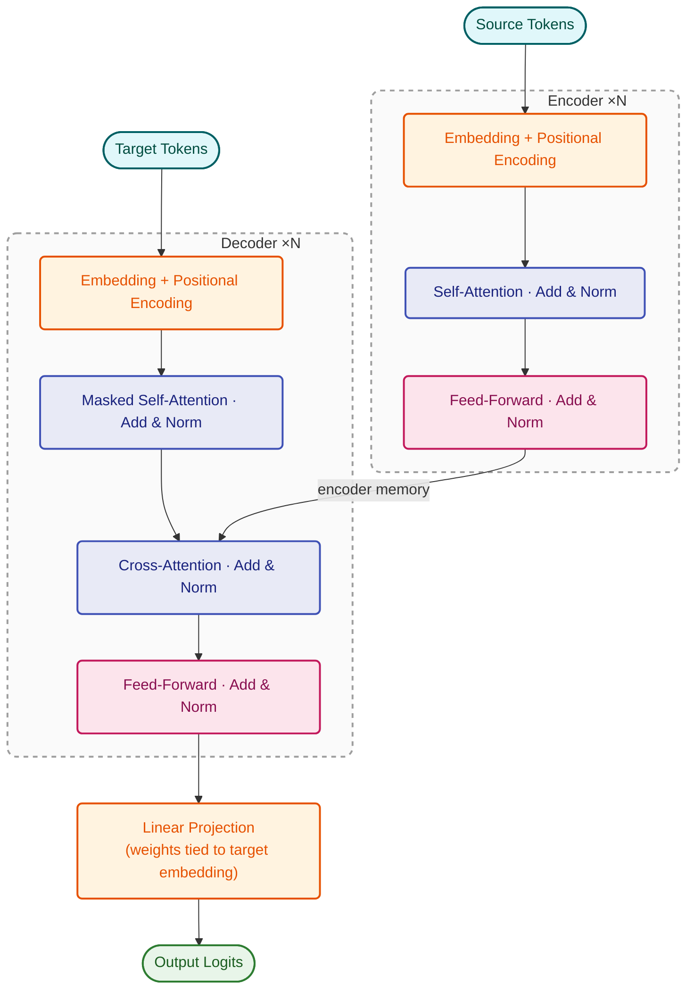

# Transformer (from-scratch Implementation)

A from-scratch PyTorch implementation of the Transformer architecture (*Attention Is All You Need*, Vaswani et al. 2017), trained on the [ManyThings](https://www.manythings.org/anki/) English–French dataset for sequence-to-sequence translation.

---

## Project Structure

```
transformer/
├── configs/
│   ├── data_config.yaml      # dataset, tokenizer, and eval settings
│   ├── model_config.yaml     # model architecture hyperparameters
│   └── train_config.yaml     # training hyperparameters
│
├── data/
│   └── manythings/
│       └── fra.txt           # tab-separated EN↔FR sentence pairs
│
├── scripts/
│   ├── download_data.py      # downloads the ManyThings EN-FR dataset
│   ├── train.py              # main training script
│   ├── train_toy.py          # minimal toy example (5 sentence pairs)
│   └── predict.py            # CLI inference script
│
├── src/
│   ├── data/
│   │   ├── dataset.py        # TranslationDataset (PyTorch Dataset)
│   │   ├── dataloader.py     # collate_fn with padding
│   │   ├── tokenizer.py      # SentencePiece BPE tokenizer wrapper
│   │   └── vocab.py          # simple whitespace vocabulary (fallback)
│   │
│   ├── model/
│   │   ├── transformer.py    # top-level Transformer module
│   │   ├── encoder.py        # TransformerEncoder + EncoderLayer
│   │   ├── decoder.py        # TransformerDecoder + DecoderLayer
│   │   ├── masks.py          # padding mask and causal mask helpers
│   │   └── layers/
│   │       ├── attention.py          # ScaledDotProductAttention
│   │       ├── multihead_attention.py
│   │       ├── feed_forward.py       # PositionwiseFeedForward
│   │       ├── positional_encoding.py
│   │       ├── embeddings.py         # TokenEmbedding (scaled)
│   │       └── layer_norm.py         # custom LayerNorm
│   │
│   ├── inference/
│   │   ├── greedy_decode.py   # autoregressive greedy decoding
│   │   └── beam_search.py     # beam search decoding
│   │
│   ├── training/
│   │   ├── trainer.py         # single epoch training loop
│   │   ├── scheduler.py       # Transformer LR schedule (warmup + decay)
│   │   ├── checkpoint.py      # save / load checkpoints
│   │   └── metrics.py         # token-level accuracy helper
│   │
│   └── utils/
│       ├── config.py          # YAML config loader
│       └── seed.py            # global random seed setter
│
├── tokenizers/                # saved SentencePiece model files (generated)
├── checkpoints/               # saved model checkpoints (generated)
├── tests/                     # unit tests
└── requirements.txt
```

---

## Architecture

The model follows the original Transformer architecture exactly:




**Key implementation details:**
- **Weight tying** — the output projection layer shares weights with the target token embedding, reducing parameters and improving training stability.
- **Scaled embeddings** — token embeddings are multiplied by `√embed_dim` before positional encoding is added.
- **Custom LayerNorm** — implemented from scratch (pre-norm not used; post-norm as in the original paper).
- **Causal mask** — a lower-triangular boolean mask prevents the decoder from attending to future positions.

---

## Setup

```bash
git clone https://github.com/vinayak-ktp/transformer.git
cd transformer
python -m venv venv
source venv/bin/activate
python install.py
python -m scripts.download_data   # downloads data/manythings/fra.txt (~170K EN↔FR pairs)
```

**Requirements:** `torch`, `sentencepiece`, `sacrebleu`, `numpy`, `pyyaml`, `tqdm`, `pytest`

> `scripts/train.py` also calls the download automatically if the file is missing, so this step is optional.

---

## Configuration

All hyperparameters are controlled via three YAML files. Edit these before training.

### `configs/data_config.yaml`

```yaml
data_path: data/manythings/fra.txt   # path to the tab-separated dataset
max_pairs: 30000                      # number of pairs to load from file
max_src_len: 20                       # max tokenised source length (filter)
max_tgt_len: 20                       # max tokenised target length (filter)
val_ratio: 0.1                        # fraction of data held out for validation

tokenizer: sentencepiece
tokenizer_model_type: bpe
tokenizer_vocab_size: 8000            # BPE vocabulary size
tokenizer_prefix: tokenizers/fra_shared  # where to save/load the tokenizer

bleu_eval_samples: 500                # val sentences decoded per epoch for BLEU
```

### `configs/model_config.yaml`

```yaml
embed_dim: 256      # embedding / model dimension
num_heads: 4        # attention heads (must divide embed_dim)
hidden_dim: 512     # feed-forward inner dimension (typically 4× embed_dim)
num_layers: 3       # number of encoder and decoder layers
dropout: 0.1
max_len: 5000       # maximum positional encoding length
```

### `configs/train_config.yaml`

```yaml
batch_size: 64
epochs: 50
warmup_steps: 500       # LR warmup steps (keep small for small datasets)
scheduler_factor: 1.0   # scales the peak LR

label_smoothing: 0.1
gradient_clip: 1.0
weight_decay: 0.0

save_every: 5           # save a periodic checkpoint every N epochs
seed: 42
device: cuda            # falls back to cpu automatically if CUDA unavailable
```

> **Warmup tip:** `warmup_steps` should be proportional to dataset size. For 27K training pairs at batch_size=64, ~422 steps/epoch — so `warmup_steps: 500` means peak LR is reached after roughly epoch 1, which is appropriate. The original paper's value of 4000 is designed for datasets 10× larger.

---

## Training

Run from the project root:

```bash
python -m scripts.train
```

The script will:
1. Load and filter the dataset from `data_config.yaml`
2. Train (or load) a shared BPE tokenizer and save it to `tokenizers/`
3. Train the model, printing a per-epoch table of train loss, val loss, and corpus BLEU
4. Save a checkpoint to `checkpoints/best.pt` whenever BLEU improves
5. Save periodic checkpoints (e.g. `checkpoints/epoch_10.pt`) every `save_every` epochs
6. Print sample translations from the best checkpoint at the end

**Example output:**
```
Using device: cpu

Loading up to 30,000 pairs from data/manythings/fra.txt …
  Loaded 30,000 pairs
Found existing tokenizer at tokenizers/fra_shared.model, loading …
  Tokenizer vocab size: 8,000
Filtering pairs to max_src=20, max_tgt=20 …
  Retained 30,000 pairs after filtering
  Train: 27,000  |  Val: 3,000

Model parameters: 8,057,664

──────────────────────────────────────────────────────────────────────
 Epoch  Train Loss   Val Loss     BLEU
──────────────────────────────────────────────────────────────────────
     1     40.3244    11.4029     0.21 ←
     2      8.4224     5.6589     0.34 ←
   ...
```

### Toy training (smoke test)

A minimal script that trains on 5 hard-coded sentence pairs — useful for quickly verifying the pipeline works end-to-end:

```bash
python -m scripts.train_toy
```

---

## Inference

### Single sentence

```bash
python -m scripts.predict "How are you?"
```

### Beam search decoding

```bash
python -m scripts.predict "How are you?" --mode beam --beam-width 4
```

### Specific checkpoint

```bash
python -m scripts.predict "I love you." --checkpoint epoch_20
```
Checkpoints are resolved as `checkpoints/<name>.pt` automatically — no path or extension needed.

### Interactive mode

Omit the sentence argument to enter a REPL:

```bash
python -m scripts.predict

# Interactive mode — type a sentence and press Enter. Type 'exit' to quit.
#
# EN > Good morning.
# FR > Bonjour.
#
# EN > exit
# Exiting.
```

**All CLI options:**

| Flag | Default | Description |
|---|---|---|
| `sentence` | *(none)* | Sentence to translate; omit for interactive mode |
| `--checkpoint` | `best` | Checkpoint name under `checkpoints/` |
| `--mode` | `greedy` | Decoding strategy: `greedy` or `beam` |
| `--beam-width` | `4` | Beam width (only used with `--mode beam`) |
| `--max-len` | `50` | Maximum output sequence length |

---

## How the Code Flows

### Training
```
train.py
  └── load_pairs()              reads fra.txt, tab-splits into EN / FR lists
  └── filter_by_length()        drops pairs longer than max_src/tgt_len tokens
  └── train_val_split()         random 90/10 split
  └── train_sentencepiece_tokenizer()   trains shared BPE model on all sentences
  └── TranslationDataset        encodes pairs; wraps target with <SOS>…<EOS>
  └── DataLoader + collate_fn   pads variable-length sequences to batch max
  └── Transformer(...)          builds the model
  └── TransformerLRScheduler    warmup then inverse-sqrt decay
  └── [epoch loop]
        └── train_one_epoch()   teacher-forcing forward pass → CrossEntropy loss → backprop
        └── compute_val_loss()  same forward pass, no gradients
        └── compute_bleu()      greedy-decode 500 val samples → sacrebleu corpus BLEU
        └── save_checkpoint()   saves best BLEU and periodic checkpoints
```

### Inference (greedy)
```
greedy_decode(model, src, sos_idx, eos_idx, max_len, device)
  └── encoder.forward(src, src_mask)   → memory  (one pass, cached)
  └── [loop until <EOS> or max_len]
        └── decoder.forward(ys, memory, tgt_mask)
        └── fc(out)                    → logits
        └── argmax(logits[:, -1, :])   → next token
        └── append to ys
  └── return ys (token ID sequence)
```

### Inference (beam search)
Same encoder pass, but the loop maintains the top-K candidate sequences ranked by cumulative log-probability, expanding each by `beam_width` tokens per step.

---

## Tests

```bash
python -m pytest tests
```

Tests cover masks, attention, encoder/decoder shapes, the LR scheduler, and tokenizer behaviour.

---

## Improving Translation Quality

| Change | Impact | Config key |
|---|---|---|
| Train more epochs | High | `epochs` |
| Reduce `warmup_steps` to match dataset size | High | `warmup_steps` |
| Use more data (`max_pairs`) | High | `max_pairs` |
| Increase model size (`embed_dim`, `num_layers`) | Medium (needs GPU) | `model_config.yaml` |
| Use beam search at inference | Low–Medium | `--mode beam` |
| Allow longer sentences (`max_src_len`, `max_tgt_len`) | Medium | `data_config.yaml` |
